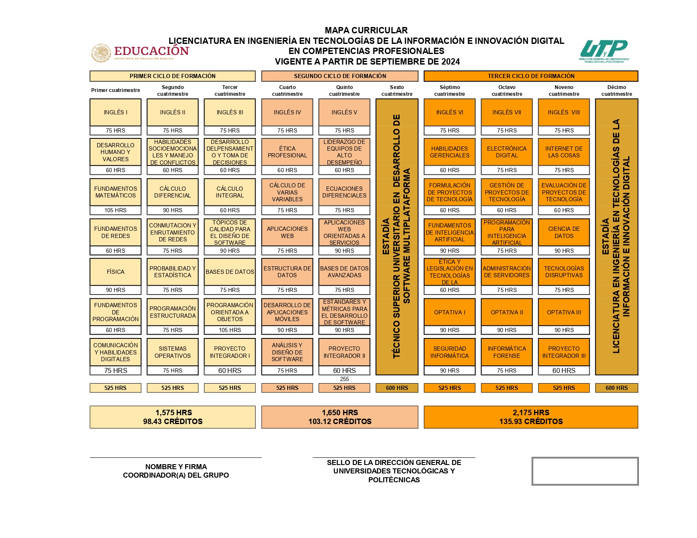
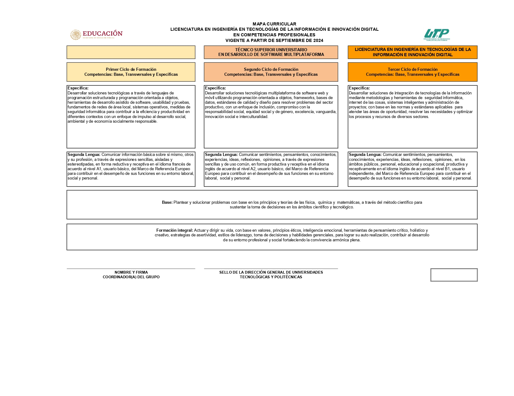

   
 <h1> Licenciatura en Ingeniería en Tecnologías de la Información e Innavación Digital (Desarrollo de Software Multiplataforma)</h1>

 

  
 

 
Este es mi repositorio sobre la mi estancia en la Universidad Tecnologica de Nezahualcoyotl, documentare toda la información mas relevante, la carrera consta de 10 cuatrimestres lo que son alrededor de 3 años y 4 meses. 

 

   
  

