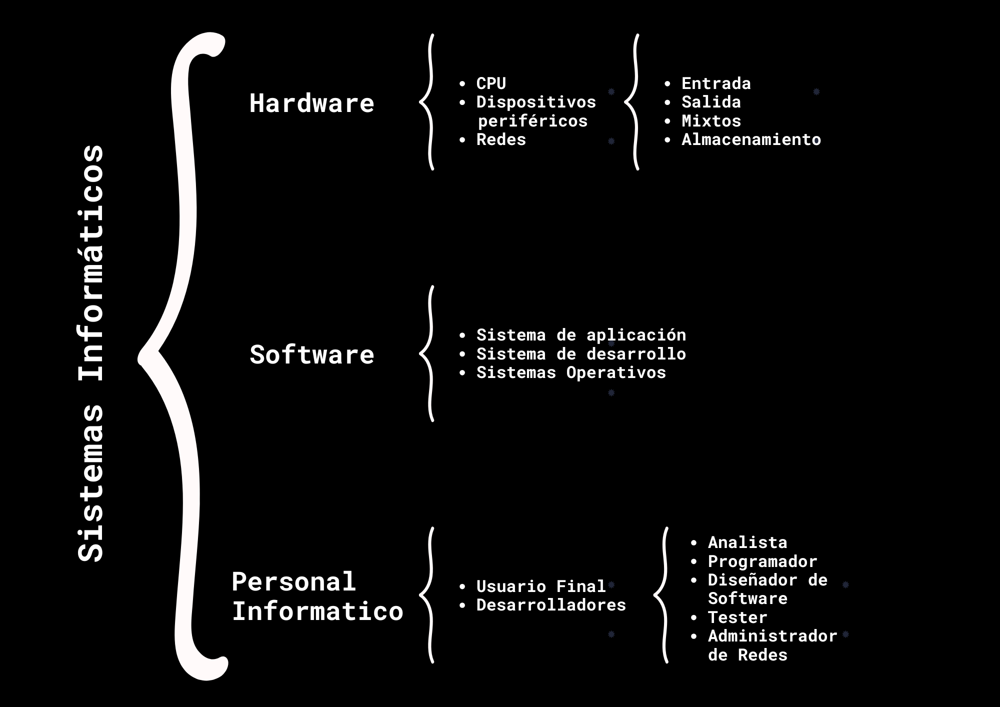
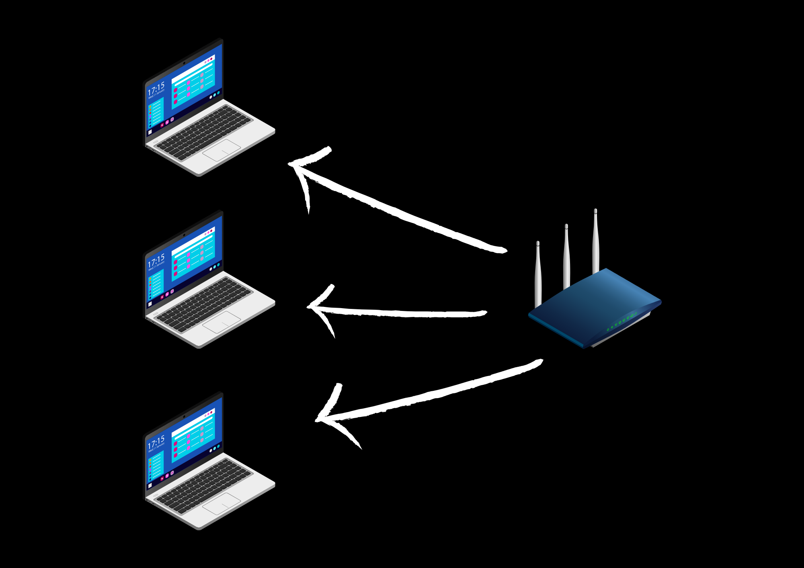

 
 <h1> Fundamentos de redes  </h1>

 
 

  

 
## Introducción a las redes de datos 

 
Las redes de datos son sistemas que permiten la transmisión y el intercambio de información entre dispositivos, computadoras y servidores. Estas redes conectan multiples dispositivos, facilitando la comunicación y el acceso a recursos compartidos. Además, existen redes inalambricas WIFI que permiten conexiones sin cables a través de ondas de radio.  
 
Dependiendo de su tamaño y alcance, las redes pueden clasificarse en varios tipos: 
1. LAN (Local Area Network - Red de Área Local)
Una LAN conecta dispositivos dentro de un área pequeña, como una casa, oficina o edificio. Utiliza cables Ethernet o Wi-Fi para la comunicación y suele tener alta velocidad de conexión. 

  

2. WAN (Wide Area Network - Red de Área Amplia)
Las WAN cubren grandes distancias, como ciudades, países o incluso el mundo. Internet es el mejor ejemplo de una WAN, ya que conecta múltiples redes LAN a través de routers y enlaces de telecomunicaciones.

3. MAN (Metropolitan Area Network - Red de Área Metropolitana)
Las MAN cubren áreas más grandes que una LAN pero más pequeñas que una WAN, generalmente una ciudad o campus universitario. Se utilizan infraestructuras como fibra óptica para ofrecer alta velocidad de conexión.

4. WLAN (Wireless Local Area Network - Red de Área Local Inalámbrica)
Una WLAN es similar a una LAN pero sin cables, ya que usa tecnología Wi-Fi para la conexión de dispositivos dentro de un espacio reducido, como una casa, oficina o cafetería.

5. CAN (Campus Area Network - Red de Área de Campus)
Una CAN es una red que interconecta múltiples LAN dentro de un campus universitario, empresa o base militar. Suelen usar fibra óptica y están diseñadas para cubrir grandes áreas privadas.

6. SAN (Storage Area Network - Red de Área de Almacenamiento)
Las SAN se utilizan para conectar servidores y dispositivos de almacenamiento de alta velocidad, permitiendo el acceso a grandes volúmenes de datos de manera rápida y segura. Son comunes en centros de datos.

7. VLAN (Virtual Local Area Network - Red de Área Local Virtual)
Una VLAN es una red lógica dentro de una LAN que segmenta dispositivos en grupos sin importar su ubicación física. Esto mejora la seguridad y la administración de la red.

8. PAN (Personal Area Network - Red de Área Personal)
Una PAN conecta dispositivos personales como teléfonos, tabletas, computadoras y relojes inteligentes en un rango muy corto, generalmente usando Bluetooth o USB.

